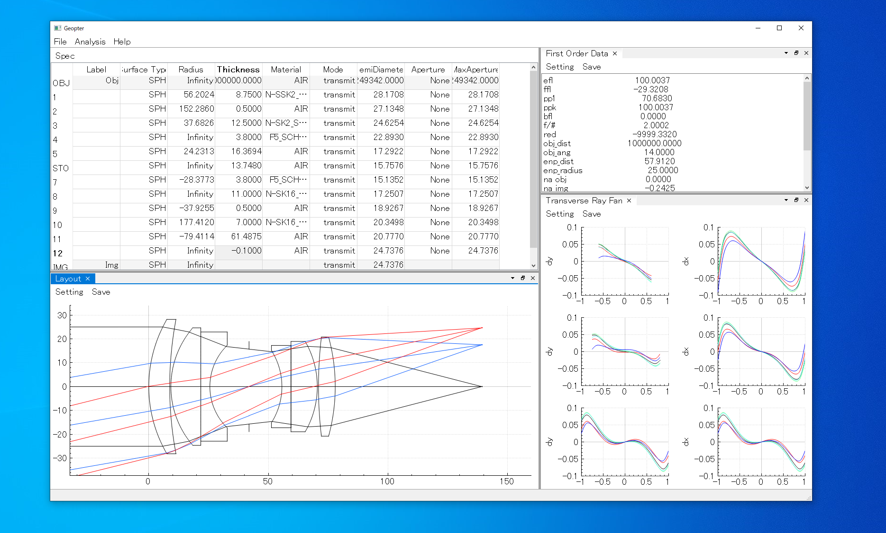

# Geopter

## Introduction
Geopter is <u>**opt**</u>ical design software based on <u>**geo**</u>metrical ray tracing.

Optical design has been aided by powerful computer and professional software such as CODE-V and Zemax, though these software are too expensive for personal users.

There have been developed and distributed increasing number of optics library.  One of the disadvantage of such library is to require matured programming skills to master them.

This project aims to be in mid-ground. Geopter features to be open-sorce and to put a higher priority to intuitive GUI allowing to focus on optical design process. 

This project is very work-in-progress. Any contributions or feedbacks are greatly appreciated.

## Getting Started
### Prebuilt Binaries
Prebuilt binaries can be downloaded from [Release page](https://github.com/heterophyllus/Geopter/releases/latest).

### Examples
Some example lenses are stored in "example" folder in json format.  In Geopter GUI, go File->Open and select a json file.

### Python scripting
Geopter doesn't have its own "macro" language unlike the exemplary software such as Zemax and CodeV.  Instead, the embedded Python console enables command scripting in order to automate a complex procedure. The "app" and "osys" object provide the accesses to the application and the optical system respectively.
For the moment, only a few functions have been implemented.

### Note
In Geopter, the array indexes(fields, wavelengths, etc) start at 0 to keep consistency with Python.

## Development
### Dependencies

|Library|Description|
|---|---|
|[Qt](https://www.qt.io)|widget toolkit for GUI|
|[Qt Advansed Docking System](https://github.com/githubuser0xFFFF/Qt-Advanced-Docking-System)|Flexible docking layout system|
|[QCustomPlot](https://www.qcustomplot.com)|Graph plotting library |
|[nlohman/json](https://github.com/nlohmann/json)|JSON utility|
|[Eigen](https://eigen.tuxfamily.org/index.php?title=Main_Page)|template library for linear algebra|
|[ttk592/spline](https://github.com/ttk592/spline)|spline interpolation|
|[PythonQt](https://mevislab.github.io/pythonqt/index.html)|dynamic Python binding for the Qt framework|

### Building from Source
All of the dependencies except Qt itself have been included in this repository.  Use cmake to generate Visual Studio solution.

Note that this application is built with Qt5 and Qt6 is currently not supported.

## License
This project is licensed under GPL license - see the [LICENSE](LICENSE.md) for details.

## Contributing
Contributions and feedbacks are greatly appreciated.
Please read [CONTRIBUTING](CONTRIBUTING.md) for details on our code of conduct, and the process for submitting pull requests to us.

## Contact
- [ e-mail ](mailto:heterophyllus.work@gmail.com)

